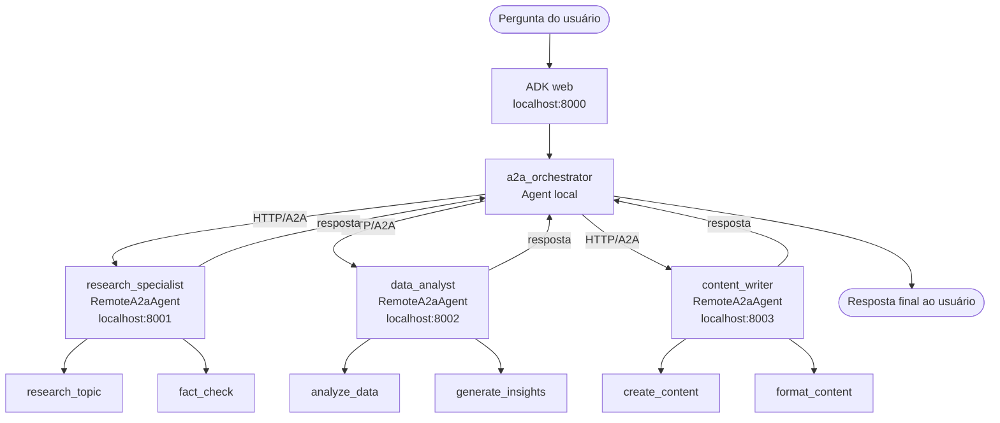

# A2A Example - Comunicação entre agentes

Demonstra o protocolo **Agent-to-Agent (A2A)** do Google ADK. Um agente
**orquestrador** (`a2a_orchestrator`) delega tarefas para três agentes
remotos especializados, cada um servido como um servidor HTTP independente.

| Agente              | Porta | Especialidade                          |
| ------------------- | ----- | -------------------------------------- |
| `research_specialist` | 8001  | Pesquisa e checagem de fatos          |
| `data_analyst`      | 8002  | Análise de dados e geração de insights |
| `content_writer`    | 8003  | Criação de conteúdo e formatação       |

## Funcionalidades do agente

### Orquestrador (`a2a_orchestrator`)

- Recebe a pergunta do usuário e decide para qual(is) agente(s) remoto(s)
  delegar
- Coordena chamadas entre múltiplos agentes remotos numa mesma requisição
- Verifica disponibilidade dos agentes remotos antes de delegar
- Registra cada passo da orquestração para fins de rastreabilidade

### Agentes remotos

- **`research_specialist`** - pesquisa abrangente de tópicos e
  fact-checking, com indicação de fontes e nível de confiança
- **`data_analyst`** - análise de dados, métricas e tendências, com
  recomendações estratégicas e avaliação de risco
- **`content_writer`** - cria artigos, sumários executivos, relatórios
  técnicos e formata conteúdo (markdown, html, texto puro)

## Fluxo de execução dos agentes



Cada agente remoto roda como um servidor HTTP isolado (gerado pelo
`to_a2a()`), exposto na rota `/.well-known/agent.json` (Agent Card). O
orquestrador descobre as capacidades e delega via `RemoteA2aAgent`.

## Conceitos abordados do ADK

- **`RemoteA2aAgent`** - representa, do lado do orquestrador, um agente
  remoto acessível via HTTP/A2A
- **`to_a2a(agent, port)`** - empacota um `Agent` local como uma aplicação
  ASGI, exposta via `uvicorn`
- **Agent Card** - descritor publicado em
  `/.well-known/agent.json`
  (`AGENT_CARD_WELL_KNOWN_PATH`) que descreve o agente para outros
  consumidores A2A
- **`sub_agents`** - o orquestrador inclui `RemoteA2aAgent`s como sub-agentes
  ao lado do próprio agente local
- **`FunctionTool`** - empacota funções Python como ferramentas para o
  orquestrador (ex.: `check_agent_availability`, `log_coordination_step`)
- **`generate_content_config`** ajustado por agente
  (temperatura mais baixa para pesquisa/análise, mais alta para criação
  de conteúdo)
- Inicialização multiprocessada multiplataforma com `run_servers.py`

## Descrição das ferramentas

### `a2a_orchestrator` (local)

| Ferramenta                  | Argumentos                          | O que faz |
| --------------------------- | ----------------------------------- | --------- |
| `check_agent_availability`  | `agent_name: str`, `base_url: str`  | Faz GET no Agent Card e devolve disponibilidade |
| `log_coordination_step`     | `step: str`, `agent_name?: str`     | Registra um passo do fluxo de orquestração |

### `research_specialist` (remoto, porta 8001)

| Ferramenta       | Argumentos     | O que faz |
| ---------------- | -------------- | --------- |
| `research_topic` | `topic: str`   | Retorna pesquisa estruturada do tópico (achados, tendências, fontes, nível de confiança) |
| `fact_check`     | `claim: str`   | Avalia uma afirmação com referências de fontes consultadas |

### `data_analyst` (remoto, porta 8002)

| Ferramenta          | Argumentos              | O que faz |
| ------------------- | ----------------------- | --------- |
| `analyze_data`      | `data_description: str` | Retorna métricas, tendências, padrões e recomendações |
| `generate_insights` | `topic: str`            | Gera insights estratégicos, oportunidades e riscos |

### `content_writer` (remoto, porta 8003)

| Ferramenta       | Argumentos                                              | O que faz |
| ---------------- | ------------------------------------------------------- | --------- |
| `create_content` | `content_type: str`, `topic: str`, `details?: str`      | Cria sumário, artigo, relatório técnico ou conteúdo livre |
| `format_content` | `raw_content: str`, `format_type: str`                  | Reformata o texto em markdown, html ou texto puro |

## Exemplos de prompts

- `"Pesquise as tendências de IA em 2024 e escreva um resumo"`
- `"Analise o mercado de computação quântica e crie um artigo sobre isso"`
- `"Verifique se a afirmação 'a IA generativa vai substituir 50% dos
  empregos até 2030' é precisa"`
- `"Pesquise IA na saúde, analise as oportunidades e gere um relatório
  técnico"`

O orquestrador delega cada parte da tarefa para o agente remoto adequado e
combina os resultados na resposta final.

## Como rodar

Você vai precisar de **dois terminais**, ambos abertos na **raiz** do
projeto. Funciona igual no Windows e no macOS.

### Terminal 1 - subir os agentes remotos

```bash
uv run python a2a_example/run_servers.py
```

Esse script multiplataforma sobe os três servidores (portas 8001, 8002 e
8003), espera cada um ficar pronto e mostra o status. Deixe este terminal
aberto.

### Terminal 2 - subir o orquestrador

```bash
uv run adk web a2a_example
```

Abra <http://localhost:8000> e selecione **`a2a_orchestrator`** no menu.

### Encerrar

No Terminal 1, pressione **Ctrl+C**. O script encerra os três servidores
automaticamente (não é preciso matar processos na mão).

> Os arquivos `start_a2a_servers.sh` e `stop_a2a_servers.sh` continuam
> disponíveis como atalho **apenas para macOS/Linux**. No Windows (e como
> caminho recomendado em qualquer sistema), use `run_servers.py`, que
> funciona igual em todos eles.

## Próximos passos

Sugestões de extensão para praticar:

- **Adicionar um 4º agente remoto** especializado (ex.: `translator_agent`
  na porta 8004), expô-lo via `to_a2a()`, registrá-lo no `run_servers.py`
  e adicioná-lo aos `sub_agents` do orquestrador como `RemoteA2aAgent`.
- **Substituir os dados simulados** em `research_agent`, `analysis_agent`
  e `content_agent` por chamadas reais (ex.: `google_search` para o
  research, uma API pública para o analyst).
- **Implementar circuit breaker** no orquestrador: se
  `check_agent_availability` falhar, tentar um fallback local ou
  responder com mensagem de degradação.
- **Hospedar os agentes em containers separados**: criar um `Dockerfile`
  por agente e um `docker-compose.yml` que sobe os 3 servidores +
  orquestrador, demonstrando deploy distribuído real.
- **Adicionar autenticação A2A**: configurar tokens no Agent Card e
  validar nas requisições recebidas pelos servidores remotos.
