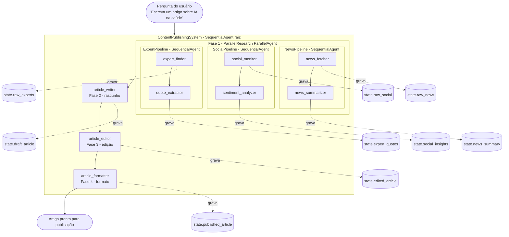

# Multi-Agent Orchestration - Sistema de publicação de conteúdo

Sistema multiagente que combina **agentes paralelos e sequenciais aninhados**
no Google ADK. Três pipelines de pesquisa rodam em paralelo (notícias, redes
sociais e especialistas) e, em seguida, três agentes em sequência produzem o
conteúdo final (rascunho, edição e formatação).

## Funcionalidades do agente

- **Pesquisa multi-fonte em paralelo**: notícias atuais, tendências em redes
  sociais e opiniões de especialistas, todas obtidas ao mesmo tempo
- **Síntese sequencial**: o conteúdo é refinado passo a passo
  (escrita → edição → formatação)
- **Compartilhamento de estado entre agentes**: cada sub-agente grava sua
  saída no estado da sessão e os agentes seguintes leem dali
- **Saída final em Markdown** com título, byline, subtítulos e citações
- Uso real do tool **Google Search** dentro dos agentes pesquisadores

## Fluxo de execução dos agentes



> O `ParallelResearch` só termina quando os 3 pipelines acabam. Cada
> sub-agente grava sua saída no estado da sessão usando `output_key`,
> e os agentes seguintes leem dali via `{var}` na `instruction`.

### Fluxo de estado entre os agentes

1. A pesquisa em paralelo escreve no estado:
   `news_summary`, `social_insights`, `expert_quotes`.
2. O `article_writer` lê os três e grava `draft_article`.
3. O `article_editor` lê `draft_article` e grava `edited_article`.
4. O `article_formatter` lê `edited_article` e grava `published_article`.

## Conceitos abordados do ADK

- **`SequentialAgent`** - executa sub-agentes em ordem, aguardando o anterior
- **`ParallelAgent`** - executa sub-agentes em paralelo, aguardando todos
- **Aninhamento de orquestrações**: `Sequential` dentro de `Parallel` dentro de `Sequential` (raiz)
- **`output_key`** - cada sub-agente grava sua resposta em uma chave do estado da sessão
- **Templating em `instruction`** - uso de `{news_summary}`, `{raw_news}` etc. para injetar valores do estado no prompt
- **Configuração Declarativa via YAML** - uso de arquivos de configuração YAML (`root_agent.yaml` e subagentes na pasta `agents/`) para modularizar, gerenciar e instanciar os agentes através do utilitário `config_agent_utils.from_config`, sem necessidade de código Python imperativo de acoplamento
- **Tool `google_search`** - ferramenta nativa do ADK usada pelos agentes pesquisadores
- **Identificação automática do `root_agent`** pelo ADK CLI/web

## Descrição dos sub-agentes e ferramentas

### Sub-agentes

| Sub-agente           | Tipo            | Lê do estado                                     | Grava em                |
| -------------------- | --------------- | ------------------------------------------------ | ----------------------- |
| `news_fetcher`       | `LlmAgent`      | -                                                | `raw_news`              |
| `news_summarizer`    | `LlmAgent`      | `raw_news`                                       | `news_summary`          |
| `social_monitor`     | `LlmAgent`      | -                                                | `raw_social`            |
| `sentiment_analyzer` | `LlmAgent`      | `raw_social`                                     | `social_insights`       |
| `expert_finder`      | `LlmAgent`      | -                                                | `raw_experts`           |
| `quote_extractor`    | `LlmAgent`      | `raw_experts`                                    | `expert_quotes`         |
| `article_writer`     | `LlmAgent`      | `news_summary`, `social_insights`, `expert_quotes` | `draft_article`       |
| `article_editor`     | `LlmAgent`      | `draft_article`                                  | `edited_article`        |
| `article_formatter`  | `LlmAgent`      | `edited_article`                                 | `published_article`     |
| `NewsPipeline`       | `SequentialAgent` | -                                              | -                       |
| `SocialPipeline`     | `SequentialAgent` | -                                              | -                       |
| `ExpertPipeline`     | `SequentialAgent` | -                                              | -                       |
| `ParallelResearch`   | `ParallelAgent`   | -                                              | -                       |
| `ContentPublishingSystem` | `SequentialAgent` (raiz) | -                                  | -                       |

### Ferramentas

| Ferramenta      | Usada por                                       | O que faz                                  |
| --------------- | ----------------------------------------------- | ------------------------------------------ |
| `google_search` | `news_fetcher`, `social_monitor`, `expert_finder` | Busca real na web via tool nativo do ADK |

Os agentes de síntese (`*_summarizer`, `*_analyzer`, `quote_extractor`,
`article_*`) não têm ferramentas - operam apenas com o LLM e os valores do
estado interpolados na `instruction`.

## Exemplos de prompts

- `"Escreva um artigo sobre inteligência artificial na saúde"`
- `"Crie um artigo sobre adoção de energia renovável"`
- `"Escreva sobre o futuro do trabalho remoto"`
- `"Crie um artigo explicando avanços em computação quântica"`

## Como rodar

A partir da **raiz** do projeto (veja o [README principal](../README.md)
para o setup inicial):

```bash
uv sync --all-groups   # uma vez
uv run adk web         # abre http://localhost:8000
```

Abra <http://localhost:8000> e selecione **multi_agent_orchestration** no
menu. Confirme que o `.env` da raiz está preenchido com sua `GOOGLE_API_KEY`.

## Estrutura do Módulo

O sistema foi modularizado usando a declaração declarativa via arquivos YAML do ADK, organizando a estrutura de arquivos da seguinte forma:

```text
multi_agent_orchestration/
├── README.md
├── agent.py               # Script principal que inicia o root_agent
├── root_agent.yaml        # Configuração raiz (SequentialAgent)
└── agents/                # Configurações de pipelines e subagentes
    ├── parallel_research.yaml  # Orquestrador de pesquisa concorrente (ParallelAgent)
    ├── news_pipeline.yaml      # Pipeline sequencial de notícias
    ├── news_fetcher.yaml       # Buscador de notícias (LlmAgent com google_search)
    ├── news_summarizer.yaml    # Sumarizador de notícias (LlmAgent)
    ├── social_pipeline.yaml    # Pipeline sequencial de redes sociais
    ├── social_monitor.yaml     # Monitor de tendências sociais (LlmAgent com google_search)
    ├── sentiment_analyzer.yaml # Analisador de sentimento (LlmAgent)
    ├── expert_pipeline.yaml    # Pipeline sequencial de opiniões de especialistas
    ├── expert_finder.yaml      # Localizador de especialistas (LlmAgent com google_search)
    ├── quote_extractor.yaml    # Extrator de citações (LlmAgent)
    ├── article_writer.yaml     # Redator principal (LlmAgent)
    ├── article_editor.yaml     # Editor de estilo e gramática (LlmAgent)
    └── article_formatter.yaml  # Formatador final em Markdown (LlmAgent)
```

## Próximos passos

Sugestões de extensão para praticar:

- **Adicionar um 4º pipeline de pesquisa** em paralelo (ex.: pipeline de
  dados estatísticos ou pipeline de papers acadêmicos), gravando em
  `state["data_summary"]` e referenciando esse novo valor no prompt do
  `article_writer`.
- **Trocar o `ParallelAgent` por `LoopAgent`** num dos pipelines para
  refinar a pesquisa em iterações até atingir um critério de qualidade.
- **Substituir o `article_editor` por um `LlmAgent` que avalia e
  re-escreve**, devolvendo o controle ao `article_writer` se a nota for
  baixa - introduzindo um ciclo de feedback.
- **Adicionar um agente revisor de fatos** após o `article_writer` que
  usa `google_search` para validar afirmações antes de seguir para o
  editor.
- **Medir o ganho real da paralelização**: instrumentar com
  `time.time()` em `before_agent_callback`/`after_agent_callback` e
  comparar com uma versão totalmente sequencial.
